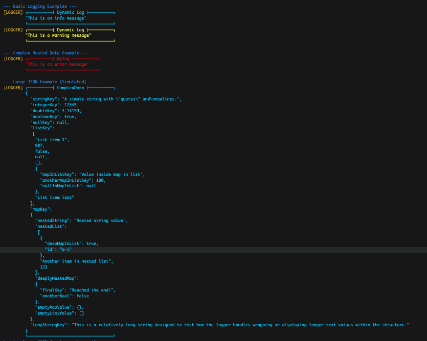

# DynamicLogger

[](https://pub.dev/packages/dynamic_logger)
[](https://opensource.org/licenses/MIT)
<!-- [](https://pub.dev/packages/dynamic_logger) -->
<!-- [](https://pub.dev/packages/dynamic_logger) -->
<!-- [](https://pub.dev/packages/dynamic_logger) -->

A flexible and memory-efficient logger for Dart/Flutter applications, providing structured, color-coded output with support for complex data types and truncation.

## Features

-   **Structured Output:** Pretty-prints Maps and Lists in a JSON-like format for easy readability.
-   **Color-Coded Levels:** Differentiates between INFO, WARNING, and ERROR logs using distinct colors (in terminals supporting ANSI codes).
-   **Handles Complex Data:** Logs primitives (String, num, bool, null), Maps, Lists, and supports `dio`'s `RequestOptions` and `FormData` out-of-the-box.
-   **Memory Efficient:** Designed to reduce intermediate string creation, especially important when logging large data structures.
-   **Truncation:** Automatically truncates deep or large collections (Maps/Lists) to prevent excessive memory usage and overly long logs.
    -   Configurable maximum depth and maximum collection entries.
    -   Can be enabled/disabled globally or per log call.
-   **Configuration:** Set global defaults for truncation behavior, depth/entry limits, and the underlying log handler (`dart:developer` by default).
-   **Clean Formatting:** Uses clear single-line headers/footers to delineate log blocks.
-   **Static Utility:** Includes `DynamicLogger.formatData` to format data structures into strings without logging.
-   **Easy Access:** Simple static methods (`DynamicLogger.log`, `DynamicLogger.configure`) for convenient use.

## Installation

Add `dynamic_logger` as a dependency in your `pubspec.yaml` file:

```yaml
dependencies:
  dynamic_logger: ^0.2.1 # Replace with the latest version
  dio: ^5.0.0 # Add dio if you need to log RequestOptions/FormData
```
Then run dart pub get or flutter pub get.

# Basic Usage
Import the package and use the static log method.

```dart
import 'package:dynamic_logger/dynamic_logger.dart';

void main() {
  // Log a simple message (defaults to INFO)
  DynamicLogger.log('User logged in successfully.');

  // Log with a specific level and tag
  DynamicLogger.log(
    'Configuration file not found, using defaults.',
    level: LogLevel.WARNING,
    tag: 'ConfigLoader',
  );

  // Log an error with a tag
  DynamicLogger.log(
    'Failed to connect to database.',
    level: LogLevel.ERROR,
    tag: 'Database',
    // stackTrace: stackTrace, // Optionally include stack trace
  );

  // Log a Map
  final userData = {'id': 123, 'name': 'Alice', 'isActive': true, 'prefs': {} };
  DynamicLogger.log(userData, tag: 'UserData');

  // Log a List
  final items = ['apple', 10, true, null, {'nested': 'value'}, []];
  DynamicLogger.log(items, tag: 'ItemList');
}

```

# Advanced Usage
## Configuration

You can set global defaults for the logger's behavior. This is useful for setting up truncation project-wide.

```dart
import 'package:dynamic_logger/dynamic_logger.dart';
import 'dart:developer' as developer; // Example: using dart:developer

void setupLogger() {
  DynamicLogger.configure(
    // Enable truncation by default for all logs
    truncate: true,
    // Set default max depth for nested structures
    maxDepth: 5,
    // Set default max entries shown for Maps/Lists
    maxCollectionEntries: 20,
    // Optionally override the default log handler (e.g., for custom output)
    // logHandler: (message, {level, name, ...}) {
    //   print("[$name - Level $level]: $message");
    // }
  );

  print("Logger configured with default truncation.");
}

void main() {
  setupLogger();
  // Subsequent logs will use the configured defaults unless overridden
  // DynamicLogger.log(someVeryLargeMap); // Will be truncated by default
}
```
## Truncation Per Call
Even if you have global defaults, you can override truncation settings for specific log calls.

```dart
// Assume default truncation is enabled via configure()
// final largeJsonData = ...; // Your large data structure

// Log a specific large object WITHOUT truncation for debugging
DynamicLogger.log(
  largeJsonData,
  tag: 'FullDebugData',
  truncate: false, // Disable truncation for this call only
);

// Log another large object with stricter limits than the default
DynamicLogger.log(
  largeJsonData, // Using the same data for example
  tag: 'BriefOverview',
  truncate: true, // Ensure truncation is on for this call
  maxDepth: 2,
  maxCollectionEntries: 5,
);

```
## Formatting Data (formatData)
Use `formatData` to get the formatted string representation of an object without actually logging it. It respects the configured truncation defaults unless overridden.

```dart
final data = {'a': 1, 'b': [1, 2, 3], 'c': {'d': 'hello'} };

// Format using default truncation settings
String formattedString = DynamicLogger.formatData(data);
print("Formatted Data:\n$formattedString");

// Format with specific truncation for this call
String truncatedString = DynamicLogger.formatData(
  data,
  truncate: true,
  maxDepth: 1,
  maxCollectionEntries: 1,
);
print("\nTruncated Formatted Data:\n$truncatedString");

```

## Example Output
*** (Note: Colors are represented conceptually. Actual output depends on terminal support.) ***



## License
MIT License. See the [LICENSE](LICENSE) file for details.